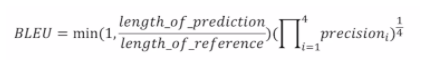

# Beam Search and BLEU score

## Beam Search
- Seq2Seq에서 더 좋은 생성 결과를 얻는 기법
- Greedy decoding이란?
    - 매 time step마다 가장 확률이 높은 단어 1개를 선택해서 decoding
    - 문제점 : 번역을 하는 중간에 하나를 틀렸다면 그 뒤로는 더 많이 틀릴 가능성이 높아짐.
- Beam Search란?
    - k개의 숫자를 가정하고 k개의 시나리오만 반복적으로 선택해 나가는 방식

## BLEU score
- 자연어 생성모델의 품질, 결과의 정확도를 평가하는 척도
- precision
    - 맞은 단어의 갯수 / 출력 문장의 길이
- recall
    - 맞은 단어의 갯수 / 정답 문장의 길이
  
- BLEU는 recall을 사용하지 않음.
- BLEU는 기하평균을 사용함.
- N-gram 
    - 한번에 묶어서 presion을 봄
    - 1-gram이면 한번에 한단어씩 묶음
    - 2-gram이면 한번에 두단어씩 묶음
