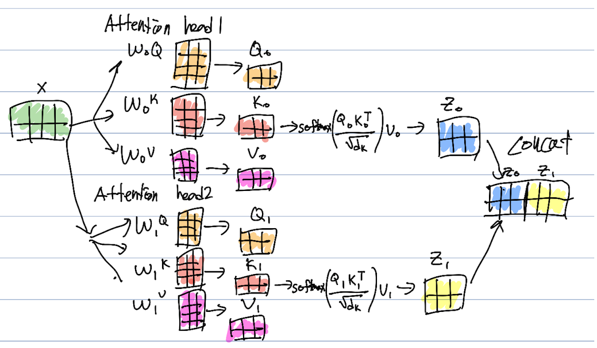
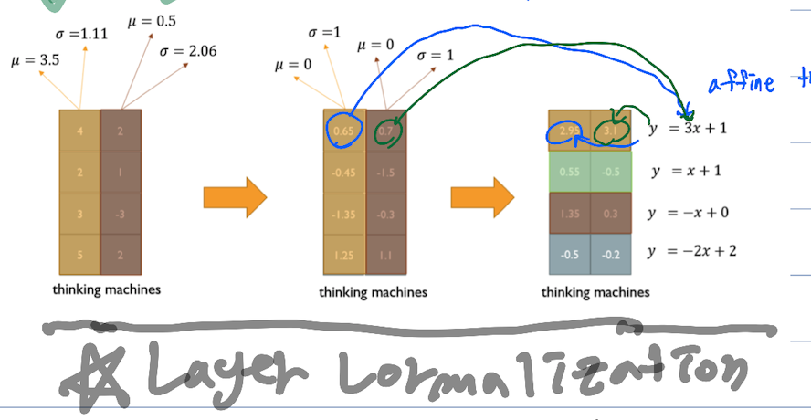
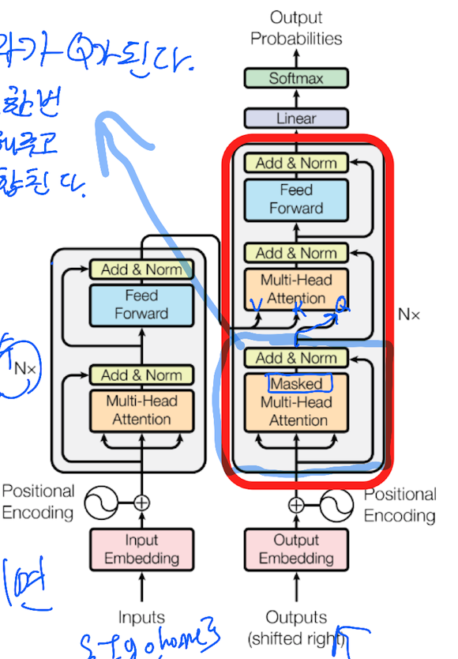

# Transformer(2)
- Multi-Head Attention
    - V,K,Q의 '특성'을 분리해서 별도의 W값들을 만들어주는것이다.
    - 동일한 문장에서 다른 특성을 추출할수 있다.
    - 특성을 분리하는 구간은 head를 통해 몇개로 나눌지 정한다.
    - Scaled Dot-Product Attention까지의 과정이 끝나면 concat해서 결과를 취합한다.
  

    - layer연산속도는 느리지만 rnn,cnn에 비해 시퀀스 비례 연산이 없어짐. -> 시퀀스 전체를 계속해서 도는 형태의 연산이 없어져서 연산속도 상승
    - 대신 메모리를 더 많이 차지함.
    - Residual connection
        - Multi-Head Attention의 input과 output을 각 원소끼리 더하는것
        ex) input 3행 5열 + output 3행 5열
        - gradient vanishing 문제 해결
    - Layer normalization
        - 평균을 0 분산을 1로 만들어준다.
  
        - 학습 안정화 및 성능향상
        - affine transformation
    - Positional Encoding
        - input에 positional(순서)를 알려줄 수 있는 장치를 해주는것
        - sin, cos을 이용하는 방법이 있음
        - attention의 '순서 없음'문제를 해결해주는 장치
    - Masked Multi-Head Attention
        - softmax에서 연관도가 낮은 원소들을 0으로 만들어준다.
        - 대각행렬 윗쪽으로 다 0으로 만들어준다. (왜?)

    최종 transformer 형태
      

        

        