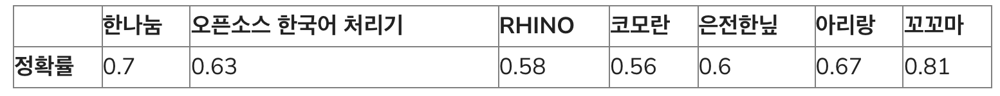

# W2V 코드 구현
- ./code/w2v_cbow
- 3인 페어프로그래밍
    - 세명이서해서 더 느리다는 느낌은 들었지만 코드 하나하나, 사용하는 라이브러리를 명확히 파악할 수 있어서 너무 좋았고 훨씬 많이 배울 수 있었습니다.
- word를 Okt(형태소 분리기)를 이용해서 형태소 단위 분리
    - 아래의 내용을 고려한 결과 Okt보다 성능이 좋고 분석이 빠른것들은 있었지만 성능보다는 사용해보는것이 중요하기 때문에 다른 좋은 성능의 분리기들은 나중에 많이 사용할것 같아서 사용했음
    - 한국어 형태소 분리기 종류
        - 한나눔
        - Open Korean Text(Okt)
        - KOMORAN
        - Mecab(은전한닢)
        - 아리랑
        - RHINO
        - 꼬꼬마
        - khaiii
        <http://semantics.kr/%ED%95%9C%EA%B5%AD%EC%96%B4-%ED%98%95%ED%83%9C%EC%86%8C-%EB%B6%84%EC%84%9D%EA%B8%B0-%EB%B3%84-%EB%AC%B8%EC%9E%A5-%EB%B6%84%EB%A6%AC-%EC%84%B1%EB%8A%A5%EB%B9%84%EA%B5%90/>
    - Okt, 한나눔 -> 문장 분리기 제공(나머지는 문장 분리기 필요)
    - KoalaNLP -> 문장 분리기
    - 실험 결과 
          
    - 수치는 꼬꼬마가 제일 높지만 꼬꼬마는 너무 문장을 작게 분리하는 경향이 있음.
    - 한나눔이 가장 괜찮은 성능을 보였지만 작은 실험이였기 때문에 정확한 평가는 아님. 참고자료로 사용
    - <https://iostream.tistory.com/144>
    - 위의 블로그를 참고한 결과
    - 사용할 데이터의 특성(띄어쓰기 유무 등)이나 개발 환경(Python, Java)에 따라서 적합한 형태소 분석기를 고려해야함
    - 연산 속도가 중요하다면 mecab(분석 품질도 상위권)
    - 자소 분리, 오탈자 분석 품질이 보장되야 한다면 komoran
    - 한나눔,okt는 로딩시간이
    - 한나눔,khaiii,okt는 세세한 품질 아쉬움
    - 꼬꼬마는 분석 시간에서 약간 아쉬운 점이 보임
    - okt, 한나눔은 로딩시간이 빠른편이라서 가볍게 쓰기 좋음
    - 각각 특성에 맞춰서 사용하기
    
- 분리된 데이터를 이용해서 dict type vocab제작
    - 연산 속도를 위해 dict comprehension 사용
- CBOW
    - 문장내 주변 단어를 input으로 넣으면 중심 단어를 찾아준다.
- CBOW dataset제작
    - window size를 고려해서 주변 데이터를 몇개 까지 볼지를 정할수 있게 프로그래밍함
    - 윈도우사이즈를 문장내의 기준으로 가장 오른쪽과 왼쪽의 단어들에 대한 정보는 넣어주지 않음
    - vocab을 이용해서 단어들 숫자로 바꿔줌
- CBOW model 제작
    - nn.Embedding을 이용해서 각 단어들 vocab_size로 onehot > hidden_size로 특성 분리(학습할 W들 추가)
    - 여러 단어들을 각 특성별 평균값 구해서 하나의 단어로 만들었음
    - 한개로 만들어진 hidden_size의 단어를 nn.Linear를 이용해서 vocab_size로 만들어줄 W 추가
- 학습 코드 작성
    - 간단한 테스트를 위한 학습 코드
    - 빠른 최적화를 위한 Adam
    - CrossEntropy사용
