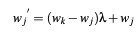
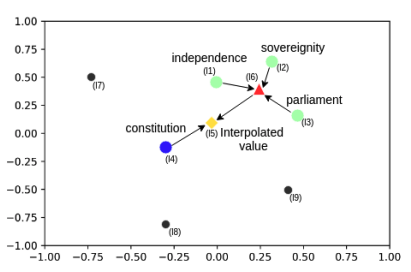
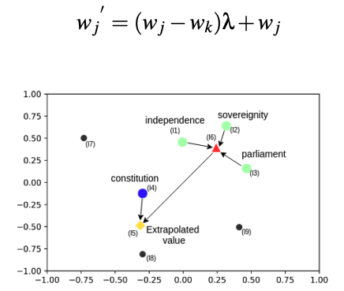
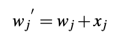
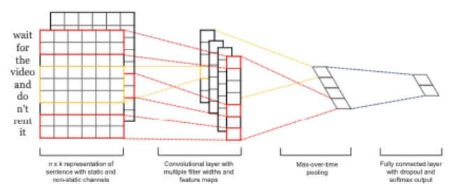
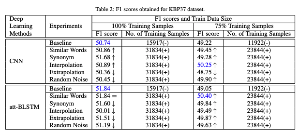
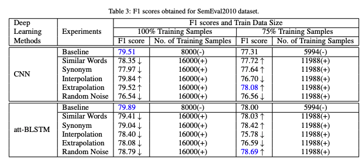

# A Study of Various Text Augmentation Techniques for Relation Classification 논문 요약

### 제목을 보고 느낀점
자유문헌의 관계분류를 위한 다양한 텍스트 증강기법에 관한 연구
- 관계분류를 위한 테스크
- 텍스트 Augmentation에 대한것이군 → 텍스트를 늘리거나 줄이거나 바꾼다.
- Various가 들어간걸봐서 여러개를 소개할 것으로 보임.

### 단락별 요약 정리
#### 1. Abstract
- 이미지에서 사용하던 augmentation 기법을 텍스트에서 어떻게 하면 좋을지를 연구한 자료이다.
- 관계 분류는 한 문장엔에서의 두개의 entity가 어떤 "관계"class 로 분류 되는지에 대한 task 이다. 그러나 NLP에서는 라벨링 된 데이터를 사용할 수 없기 때문에 수동적으로 데이터의 주석을 달아야 한다. 자동으로 다는 방법도 고안되었지만 수동에 비해서 너무 품질이 낮다.

- 라벨링 된 데이터를 사용할 수 없다는게 무슨뜻?
    - 라벨링 된 데이터를 구하기가 힘들다. 일상적으로 관계 추출할일이 없기 때문에!
- 수동으로 처리한 데이터 세트를 이용해서 데이터를 증가시키는 것이 그 해결방법이다. Data Augmentation!
- 문장의 문법적, contextual(문맥적) 구조를 유지하면서 텍스트 데이터를 Augmenation 하는 기술을 조사한다. Attention 기반의 BLSTM과 CNN의 차이를 분석하면서 augmentation을 볼것이다.

#### 2. Related Works
- 이미지쪽에서 Data Aug는 성능을 높이는 좋은 방법으로 잘 알려져 있다. 일반적으로 데이터가 많을수록 학습 성능이 더 잘 나오기 때문. image에서의 Aug는 돌리고, 자르고 등등의 변환이 사용된다. 
    - Krizhevsky  : ImageNet(Deng) 데이터 세트에서 심층 신경망을 훈련하기 위한 훈련 데이터 크기를 증가시키기 위해 데이터 확대 방법을 사용했다. 훈련 데이터 샘플의 증가는 모델의 overfitting 감소로 이어진다고 했음.
    이러한 기술을 통해 모델은 이미지의 추가 패턴을 학습하고 이미지 내 객체의 새로운 위치를 식별할 수 있었다.
- 비슷한 라인의 연구로 텍스트 프로세싱에서도 모델의 성능을 높이기 위한 연구들이 있었다.
    - Mueller and Tyagarajan
        - 증강 데이터를 생성하고 문장 유사성 작업을 위한 샴 recuurent network 를 훈련하기 위해 문장의 임의 단어를 각 동의어로 대체했다 (동의어 대체)
    - Wang and Yang
        - 단어 임베딩을 통한 데이터 증강으로 트윗 데이터 클래스 분류를 만들었음. cos similiarty 사용해서 원래 단어의 대체물로 사용함. 단어는 stochastical하게 만들어졌다.
        - 워드 임베딩 기반 단어 대체 방법!
- Papadaki와 Zhang and Yang
    - Papadaki
        - 법률 데이터셋(Chalkidis)에서 데이터 aug를 함. 단어 토큰들을 이용해 W2V 모델(Mikolov)를 이용했음.
        - 세개의 기법 : interpolation, extrapolation, random noise
        - 이 세개가 잘 작동했음.
- Zhang과 Yang
    - perturbation methods를 사용함.
- 자유 텍스트분야에서 지금까지는 명확히 이런 연구는 없었음.

#### 3. Augmentation Methods
- 지금 레이블링 된 데이터가 너무 양이 적다.
- distant supervision method가 있긴 한데 노이즈에 취약함.
- 텍스트를 생성하는데는 단어 유사성과 동의어가 사용된 반면, 일반적인 embedding level aug에서는 interpolation and extrapolation methods 가 사용되었음. 증강 기법을 쓰기 위해  NLTK POS tagger를 이용
- 명사, 형용사, 부사만으로 데이터를 제한시킨다음 증가시켰더니 더 의미 보존에서 좋은 성능을 보임. 이 실험에서는 Glove가 단어 임베딘에서 사용됐음.
##### 3.1 Similar Words Method
- 유사 단어 방식 : Wang Yang을 이용한 단어 임베딩 유사성 사용한 단어 증강
##### 3.2 Synonym Method
- Mueller와 Thiagarajan의 동의어방식을 사용

단어들을 명사, 형용사, 부사로 제한함. 동사를 건드리지 않는다.

- 외부공부 : 외삽extrapolation 내삽interpolation

    - 외삽 : 대부분의 데이터와 동떨어진 지점에서 결과값을 예측하는것 
    - 내삽 : 주위에 데이터가 많을때 결과값을 예측하는것

    - 주어진 자료범위 안에서 예측하는것은 내삽, 주어진 자료범위 밖에까지 확장해서 예측하는 것은 외삽
    - [https://m.cafe.daum.net/S2000/63o/4042?listURI=%2FS2000%2F63o](https://m.cafe.daum.net/S2000/63o/4042?listURI=%2FS2000%2F63o)
##### 3.3 Interpolation Method
  
  
- 새로운 내장 벡터를 생성하기 위한 중심과 단어 em-beding 사이의 내삽.

##### 3.4 Extrapolation Method
  
- 새로운 내장 벡터를 생성하기 위한 중심과 단어 em-beding 사이의 외삽. 

##### 3.5 Random Noise Method
  
- 임베딩에 작은 변화 값(노이즈)를 추가했고 xj는 무작위 노이즈 값이며 이 값은 평균 0 람다 1인 정규분포에서 샘플링 된다.
- 같은값의 단어가 너무 멀리 가지 않도록 작은 범위에서 유지 된다.

#### 4. Deep Learning Methods
##### 4.1 CNN
- 텍스트CNN 모델을 사용할 것임
- [https://arxiv.org/pdf/1408.5882.pdf](https://arxiv.org/pdf/1408.5882.pdf)
  

##### 4.2 Attention-Based Bidirectional LSTM
- attention 기반 bidirectional lstm을 사용할 것임.
#### 5. Dataset
- 수동으로 주석을단  10개 고유 관계 클래스 데이터셋 SemEval2010
- KBP37 데이터 세트 사용 19개 고유관계 유형 → semeval2010보다 더 많은 관계 유형이 있기 때문에 사용했음.
- 관계들 중에서 other, no-relation은 제외 했음.
- 각 관계들은 양방향 위치를 고려함. → 10개의 클래스가 있다고 할때 2배를 했다.
#### 6. Experiments
  

  
- text CNN 모델과 BLSTM로 벤치마크를 만들었음.
- PF 방법 사용
- 원래 데이터 대 클래스 비율을 유지하려고 25프로를 추출했다.
- 문법이 틀리긴 했는데 의미가 유지 되면서 증강 데이터를 생성 가능했다. 
- 하이퍼 파라미터를 바꾸다가 벤치마크에 근접한 정확도를 얻으면 하이퍼 파라미터를 고정시킴.
- 동일 하이퍼 파라미터로 새로만든 증강 데이터로 다시 학습함.
- 모든 실험에 사전 훈련된 300차원 GloVe 단어 벡터를 사용

#### 7. Experimental Results
- 사전 훈련된 GloVe 워드 벡터를 사용하는 대신 이러한 데이터 세트와 더 관련이 있는 단어 벡터를 사용하여 데이터 분포를 캡처하면 interpolation 및 extrepolation 방법이 더 잘 수행될 수 있다.
#### 8. Conclusion
- 5가지의 text data augmentation 기법을 사용했고, 수동으로 데이터를 추가하지 않고 자동으로 데이터를 추가하는 방법을 처음으로 비교해 봤다.
- 문법과 맥락을 유지하면서 새로운 것을 만드는 방법이였다.
- 작은 데이터 세트에 증강 데이터를 추가해서 원래 데이터 세트의 성능을 모방할 수 있었다.
- 향후 연구로 여러 다른 조합들을 하이브리드로 해봐도 좋고 GAN을 사용해봐도 좋을것 같다. 

한줄 요약 : 5가지 다른 text data augmentation 기법들의 성능을 비교함. 약간의 성능개선을 보임.  

Q. 관계 추출을 하는 task인데, 문법과 맥락을 정확히 지켜야하는게 아닐까?  

링크 : 
https://www.researchgate.net/publication/331784439_A_Study_of_Various_Text_Augmentation_Techniques_for_Relation_Classification_in_Free_Text
