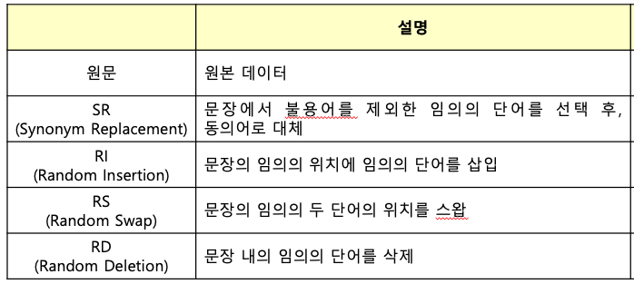
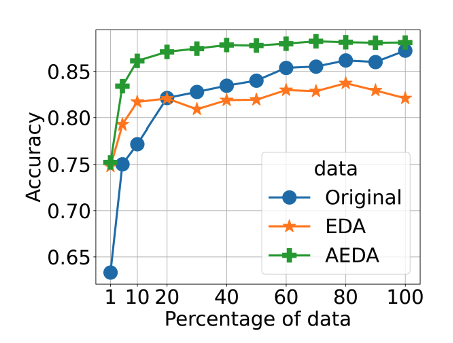

# 대회 기간 첫 주말 2일차 월요일
- AM11:00-AM01:30 14.5시간 해커톤 수준의 3인 짝 프로그래밍
## 20211004
- 오늘 한것
    - Swap augmentation 구현 완료
    - AEDA augmentation 구현 완료
    - 짝코딩 회고를 진행함

- 오늘 배운것
    - shell script로 코드 돌리는 법
        - runner.sh
        - 돌릴때 
            - nohup bash runner.sh &
        - &는 백그라운드에서 돌림
        - 터미널 명령어가 자동으로 돌아감
        - 돌리는 폴더 터미널이라고 생각하고 관리해야함.
    - nohup으로 백그라운드로 돌릴수 있음.
    - EDA, AEDA 논문 슬쩍 봤음.
        - EDA는 EasyDataAugmentation
              
            - 단어를 
                - 넣거나, 
                - 빼거나, 
                - 위치를 바꾸거나, 
                - 동의어로 바꾸거나

        - AEDA는 AnEasierDataAugmentation
            - 문장에 .,?:;! 6가지의 문장부호를 섞어서 데이터의 양을 늘리는 방식
            - EDA보다 성능 좋음.
              

        - EDA논문을 읽고 어떤 방식으로 쓸지 고민하다가 AEDA를 발견했는데 성능도 좋고 방법도 간단했음.

- 느낀점
    - 짝코딩 회고를 해서 그동안의 짝코딩 방식을 우리끼리 정리하고 앞으로 어떤식으로 하면 더 효율적일지 이야기해서 좋았음.
    - 우리팀은 코드를 완전히 나눠서 관리하고 깃허브도 관리 잘해서 회사 같은 느낌이 들정도로 분업이 잘되고 있음.
    - 짝코딩의 속도가 다시 올라가고 있음.
    - 노트북으로 빠르게 코드 짜보고 예쁘게 코드 정리해서 리펙토링 하는 방식이 좋았음.
    - 뭔가를 공부하기 전에 다같이 논문을 읽거나 레퍼런스 찾아봐서 너무 좋음.
    - public 19등에서 5등이라니 우리팀 넘흐 멋져.

