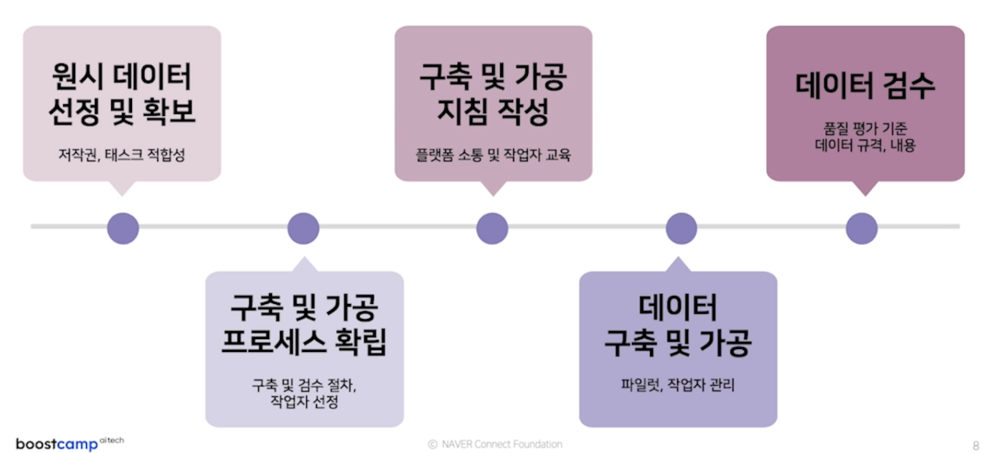

# level3 data제작

## 20211108
- 오늘 한것
    - 데이터 제작 A to Z
    - 자연어 처리 데이터 기초
    - 자언어처리 데이터 소개

- 오늘 배운것
    - 데이터 제작은 AI 프로젝트에서 가장 시간이 많이 소요된다.
     
    - 이 순서를 그대로 지키면서 데이터 제작 하면 된다.
    - 인공지능의 역사는 바뀌었지만 데이터와 과제는 바뀌지 않았다.
        - 말뭉치류
        - 사전/데이터베이스 류
    - PLM(pretrained model)이 나오면서 모델들의 성능을 측정하기 위한 벤치마크들이 만들어짐
    - 벤치마크는 각각 평가,검증,훈련 데이터가 모두 포함된다.
    - text는 원문이나 본문이라고 많이 쓴다.
    - 말뭉치 corpus는 단수형 corpora는 복수형
        - 한 저작자의 저작 전부와 같은 하나의 큰 범위를 말함.
    - 데이터는 컴퓨터가 처리할 수 있게 만든 정보 전체
    - 영어는 단어 단위 말뭉치, 한국어는 어절 단위 말뭉치
    - 한국어의 조사가 인공지능을 어렵게한다.
    - 데이터는 CSV보다 TSV가 ,가 없어서 더 좋을경우가 많다.
    - 공개 데이터들을 변형해서 데이터셋으로 만들면 좋다.
    

- 느낀점
    - 혼자서는 강의를 잘 안듣는것 같아서 팀원분들과 강의를 시간정해서 듣기로 했다.
    - 벌써 효과가 온게 내일부터 시작하기로 한 지점이 생겨서 거기까지 무조건 들어야한다.
    - 나는 스스로 강제성을 부여해야 공부하는것 같다.
    - 데이터셋의 종류나 용어를 정리할 수 있어서 좋았다.

https://zeuskim.notion.site/6a9d842dbf0b4bfab21ee8a6711a1bb6