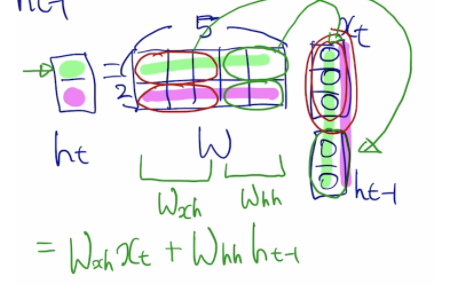
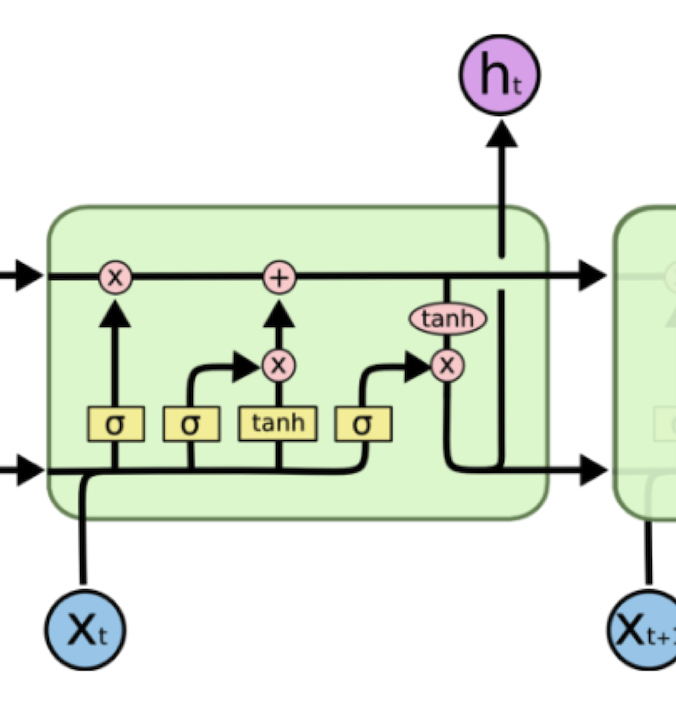
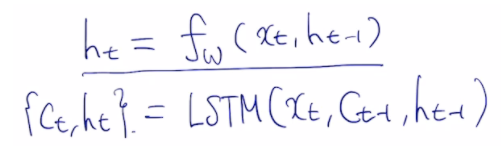
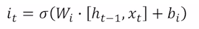
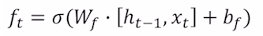
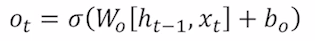
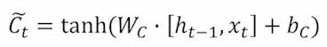
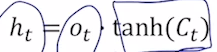

# Recurrent Neural Network

### Keywords

RNN은 연속적으로 들어오는 데이터들을 학습하는 방법

$h_{t-1} $ :  old hidden-state vector
$x_t$ : input vector at time step
$h_t$ : new hidden-state vecotr
$f_w$ : RNN function with parameters W
$y_t$ : output vector at time step $t$
$$h_t = f_W(h_{t-1},x_t)$$

###### Type of RNN

1. one-to-one
2. one-to-many
3. many-to-one
4. many-to-many

3개의 Weight를 back propagation으로 update해야함. $W_{xh}$ $W_{hh}$ $W_{hy}$

Vanshing Gradient Problem

###### LSTM(Long Short Term Memory)
  
그래디언트 소실 방지
transform 없음
  
$c_t$ 이전 time step에서 넘어온 많은 정보들이 있는 벡터
$h_t$ rnn의 $h_t$와 비슷한 개념. $c_t$에서 다음 time step에 노출할 정보만 추출한 벡터
4개의 gate
Input gate (sigmoid)
  
Forget gate (sigmoid)
  
Output gate (sigmoid)
  
Gate gate (tanh)
  
  

###### GRU (Gated Recurrent Unit)
LSTM 경량화
$C_t$와 $h_t$를 하나로 합침.
input gate를 $z_t$라고 할때 forget gate는 $1-z_t$ 

## Summary
rnn은 $h_t$를 사용하고 이전의 step에서의 연산값을 자기 자신에게 다시 넣어주는 구조이다.
LSTM이나 GRU를 쓰면서 기존 BPTT에서 곱셈으로 gradient explode/vanish 되면 문제를 덧셈 구조로 바꾸면서 해결함.
LSTM은 한 step마다 다음 step으로 넘겨주는 값이 2개이다. 다음 step에서 직접 사용할 input 벡터, 처음부터 기록한 전체 정보가 들어있는 $C_t$ 벡터
GRU는 한 step마다 다음 step으로 넘겨주는 값이 1개이다. 위의 2개의 벡터를 하나로 합침.

[Notion Full Note](https://smilingface.notion.site/Recurrent-Neural-Network-and-Language-Modeling-46bbcc05db1647aa9f2214363b61239f)